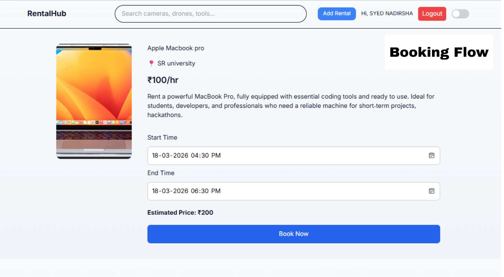
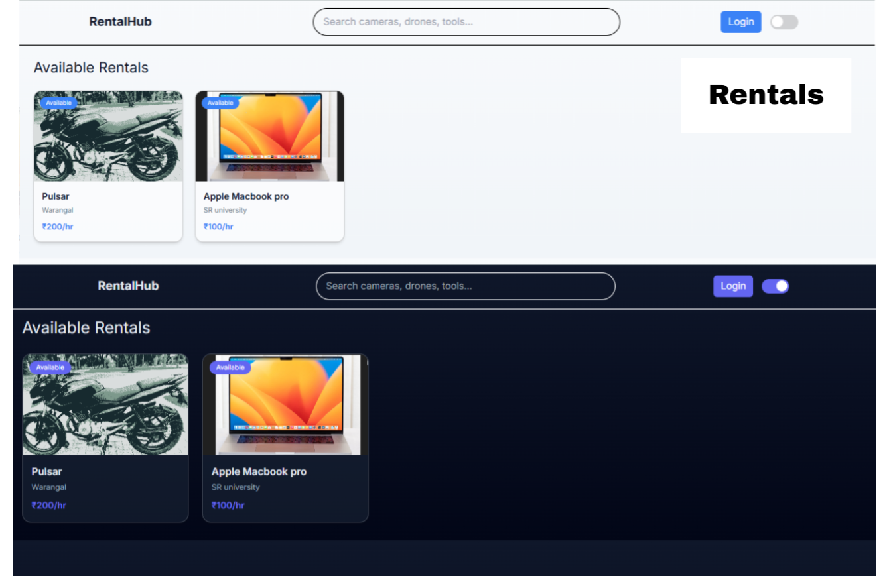
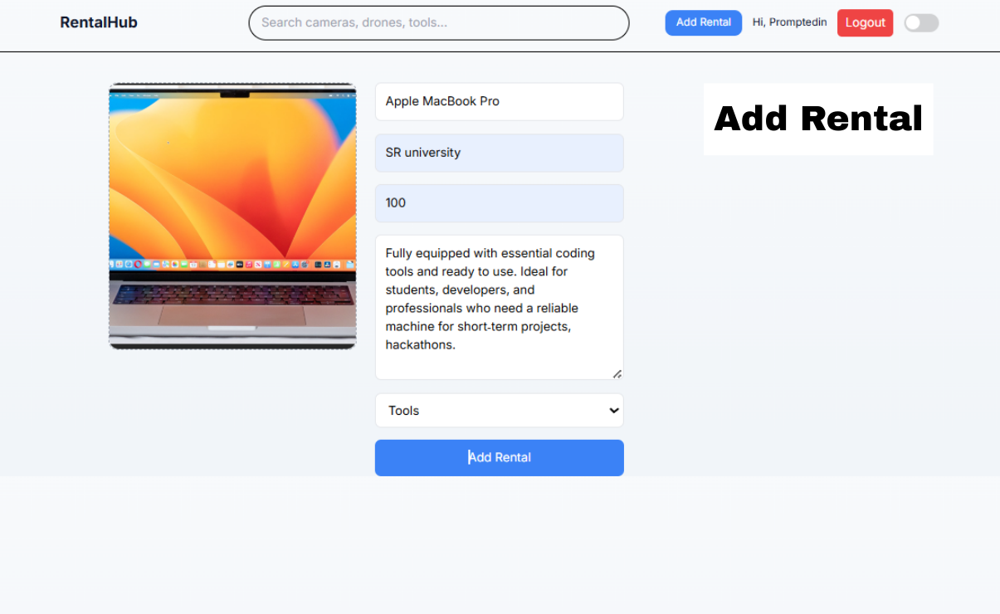
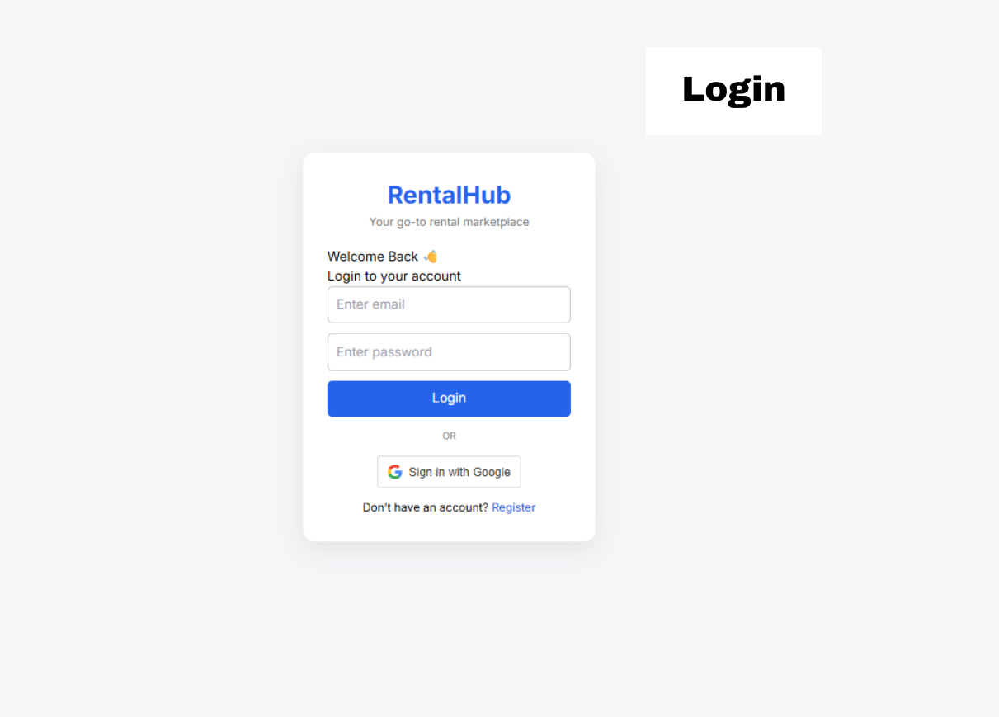

# Rental Platform (MERN)

🚧 Actively being built and improved with new features

A scalable multi-category rental backend system built using Node.js, Express, and MongoDB.

This platform supports rentals for various asset types including:

- 🚗 Cars
- 🏍 Bikes
- 📷 Cameras
- 🚜 Harvesters
- 🛠 Equipment
- and other rentable assets under a unified architecture.

---

## 🚀 Tech Stack

### Backend
- Node.js
- Express.js
- MongoDB Atlas
- Mongoose
- JWT Authentication
- bcryptjs
- dotenv

### Frontend (In Progress)
- React (Vite)
- Tailwind CSS
- Context API
- Multi-theme architecture
- Glassmorphism UI system

---

## 🏗 Architecture

- MVC pattern (Routes → Controllers → Models)
- Stateless JWT-based authentication
- Middleware-driven route protection
- Owner-based authorization
- Role-based access control (RBAC)
- Relational schema design using MongoDB references
- Environment-based configuration
- Cloud database integration (MongoDB Atlas)

---
# Screenshots




---
# 📅 Development Log

---

## ✅ Day 1 – Backend Foundation

- Express server initialized
- Clean MVC folder structure created
- MongoDB Atlas connected
- Environment variables configured securely
- Database connection error handling implemented
- Initial API testing completed

✔ Established a scalable backend base for future feature implementation.

---

## ✅ Day 2 – Authentication System

### Features Implemented

- User Registration API
- User Login API
- Password hashing using bcrypt (salt rounds = 10)
- JWT token generation
- Custom authentication middleware
- Protected route implementation
- Proper 401 handling for unauthorized access
- Secure token verification using middleware

### Security Architecture

- Passwords stored as hashed values (never plain text)
- Stateless authentication using JWT
- Route-level protection using middleware
- Proper error handling for invalid or missing tokens

✔ Authentication layer fully functional and production-structured.

---

## ✅ Day 3 – Rental Creation Module (Protected)

### Rental Model Designed With:

- `title`
- `category` (car, bike, camera, harvester, etc.)
- `description`
- `pricePerHour`
- `location`
- `owner` (linked to User model)
- `isAvailable`
- Automatic timestamps

## ✅ Day 4 – Marketplace Retrieval & Filtering

### Features Implemented

- GET all rentals
- GET single rental by ID
- Category-based filtering using query params
- Location-based filtering
- MongoDB dynamic filtering logic
- Data population using `.populate()` for owner details

✔ Rental listings now behave like a real marketplace API.

---

## ✅ Day 5 – Authorization (Owner-Based Access Control)

### Features Implemented

- Update rental (PUT) – Owner only
- Delete rental (DELETE) – Owner only
- 403 Forbidden handling for unauthorized modification
- Proper 401 vs 403 response differentiation

### Security Enhancement

- Resource ownership validation:
  - Compared `rental.owner` with `req.user._id`
  - Prevented cross-user modification

✔ Backend now enforces secure resource-level authorization.

### Features Implemented

- Protected route for creating rental listings
- Owner auto-assigned from authenticated user (`req.user._id`)
- JWT verification before database write
- Error handling for invalid input
- Proper middleware flow execution

### API Endpoint

**POST** `/api/rentals`

Headers:
```
Authorization: Bearer <JWT_TOKEN>
Content-Type: application/json
```

Example Body:
```json
{
  "title": "Honda City 2022",
  "category": "car",
  "description": "Well maintained car",
  "pricePerHour": 250,
  "location": "Hyderabad"
}
```

✔ Only authenticated users can create listings  
✔ Ownership securely enforced at backend level  

---

## ✅ Day 6 – Booking System (Core Logic Completed)

### Features Implemented

- Booking model creation
- Relational linking:
  - `user` → linked to User model
  - `rentalItem` → linked to RentalItem model
- Time-based booking (`startTime` & `endTime`)
- Automatic hourly price calculation
- Booking status system
- Protected booking route
- Validation for:
  - Missing fields
  - Invalid rental ID
  - Invalid time range (endTime > startTime)
- Error handling for booking creation

---
## ✅ Day 7 – Booking Conflict Prevention

- Time-overlap validation logic
- MongoDB-based time range conflict checks
- 409 Conflict response handling
- Prevention of double-booking

✔ Booking integrity enforced.

---

## ✅ Day 8 – Booking Cancellation System

- Booking status updates (Confirmed / Cancelled)
- Controlled cancellation flow
- Permission-based cancellation
- Proper validation & error handling

✔ Booking lifecycle management implemented.

---

## ✅ Day 9 – Role-Based Access Control (RBAC)

- Role system (Admin / Vendor / User)
- Middleware-based role protection
- Role-restricted routes
- Admin-level permissions

✔ Multi-role scalable architecture established.

---

## ✅ Day 10 – Dashboard APIs

- Role-based dashboard endpoints
- Aggregated booking statistics
- Rental ownership summaries
- Structured API responses for frontend use

✔ Backend ready for dashboard integration.

---

# 🎨 Frontend Phase

---

## ✅ Day 11 – Frontend Setup (React + Vite)

- Vite initialized
- React project structured
- Tailwind CSS integrated
- Clean scalable folder structure
- Base layout scaffolded

✔ Frontend environment prepared.

---

## ✅ Day 12 – Dashboard UI Layout

- Admin-style dashboard layout
- Sidebar navigation
- Card-based UI system
- Responsive structure
- Protected layout placeholders

✔ Scalable dashboard UI foundation created.

---

## ✅ Day 13 – Multi-Theme System & UI Refinement

Three themes implemented:

- Premium Dark (Default)
- Neon (Cyber)
- Corporate (Light)

### Architecture

- CSS Variables-based design tokens
- Centralized theme configuration
- React Context API for theme switching
- Persistent theme storage (localStorage)
- Smooth animated theme transitions
- Glassmorphism UI components

✔ Runtime theme switching with scalable design architecture.

---

# 🔐 Security Highlights

- JWT-based authentication
- bcrypt password hashing
- Middleware-based authorization
- Role-based route protection
- Resource ownership enforcement
- Backend-controlled pricing logic
- Proper HTTP status code usage

---

## ✅ Day 14 – Frontend ↔ Backend Integration

### Features Implemented

- Connected React frontend with Express backend APIs  
- Integrated rental listing API (`GET /api/rentals`)  
- Dynamic data rendering using React state  
- API error handling and loading states  
- Clean separation between UI and data layer  

### Key Learnings

- Handling async data flow in React  
- Managing API states (loading, success, error)  
- Debugging mismatched API responses  

✔ Frontend successfully consuming real backend data  

---

## ✅ Day 15 – Rental Creation UI + Image Upload

### Features Implemented

- Add Rental form UI  
- Cloudinary image upload integration  
- Live image preview before upload  
- Form state handling using React hooks  
- Disabled submit until image upload completes  

### Enhancements

- Improved UX for image uploads  
- Real-time feedback for users  

✔ End-to-end rental creation flow completed  

---

## ✅ Day 16 – My Rentals Dashboard

### Features Implemented

- User-specific rental listings  
- Conditional rendering based on ownership  
- Navigation flow between pages  
- Reusable ProductCard component  

### Architecture Improvements

- Component-based UI design  
- Better state management across pages  

✔ Users can now manage their own listings  

---

## ✅ Day 17 – Booking Flow UI Integration

### Features Implemented

- Booking UI connected to backend  
- End-to-end booking flow  
- Rental detail navigation  
- Booking API integration  

### Validation Handling

- Prevent invalid booking inputs  
- Error handling for failed bookings  

✔ Full booking lifecycle visible from UI  

---

## ✅ Day 18 – Debugging & System Stabilization

### Issues Resolved

- JWT invalid signature errors  
- Middleware execution flow issues  
- Route conflicts and duplicate handlers  
- Incorrect API responses (dummy/static data issues)  
- Module system conflicts (CommonJS vs ES Modules)  
- MongoDB connection inconsistencies  

### Key Learnings

- Importance of consistent module system (ESM)  
- Debugging multi-layer issues (Frontend + Backend + DB)  
- Verifying API responses independently  

✔ System stabilized and running end-to-end  

---

## ✅ Day 19 – Final Integration & Testing

### Final Checks

- Verified all API endpoints  
- Ensured correct DB connection  
- Tested full user flow:
  - Auth → Add Rental → View → Book  
- Fixed state inconsistencies in frontend  

✔ Application working as a complete full-stack system  

---

# 📊 UPDATED CURRENT STATUS

### Backend  
✔ Authentication system    
✔ Rental module    
✔ Owner-based authorization    
✔ Booking system    
✔ Conflict prevention    
✔ Cancellation system    
✔ Role-based access control    
✔ Dashboard APIs    
✔ Stable API responses    

### Frontend  
✔ React + Vite setup    
✔ Dashboard layout    
✔ Multi-theme system    
✔ Glassmorphism UI    
✔ Backend integration    
✔ Rental creation UI    
✔ Booking flow UI    
✔ My Rentals dashboard    
✔ API error handling    

---

# 🚀 NEXT PHASE

- Edit / Delete Rentals UI  
- Payment Integration (Razorpay)  
- Deployment (Production Environment)  
- Performance optimization  
- UI/UX improvements
---

## 💡 Vision

To build a scalable, production-ready rental marketplace capable of serving:

- Urban vehicle rentals  
- Agricultural equipment sharing  
- Event & media rentals  
- Industrial equipment marketplaces  

Built with clean architecture, security-first design, and extensibility as core principles.
